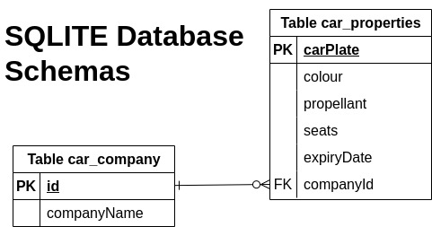
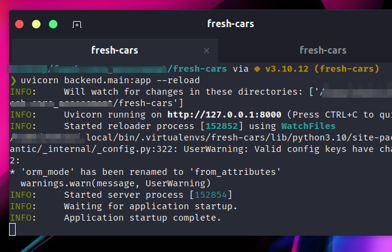
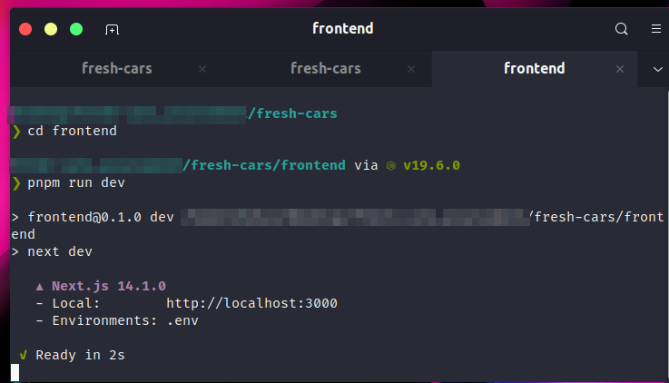
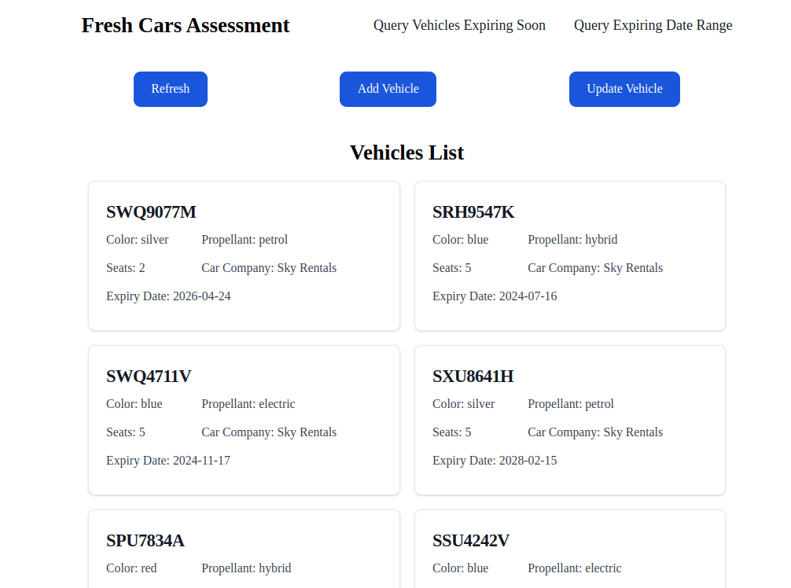
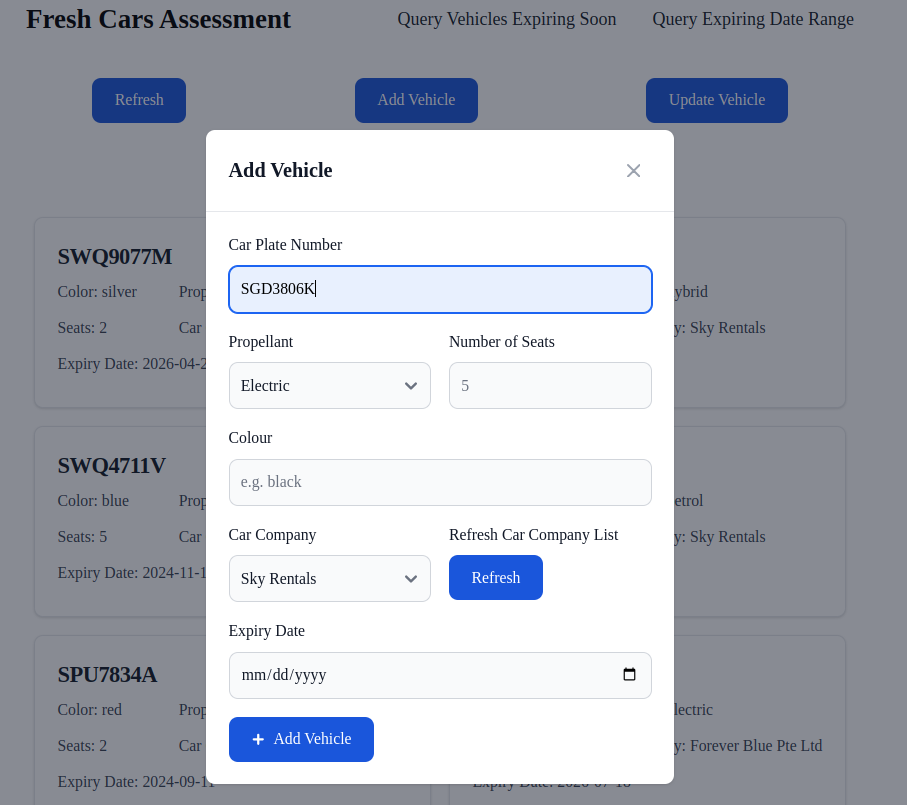
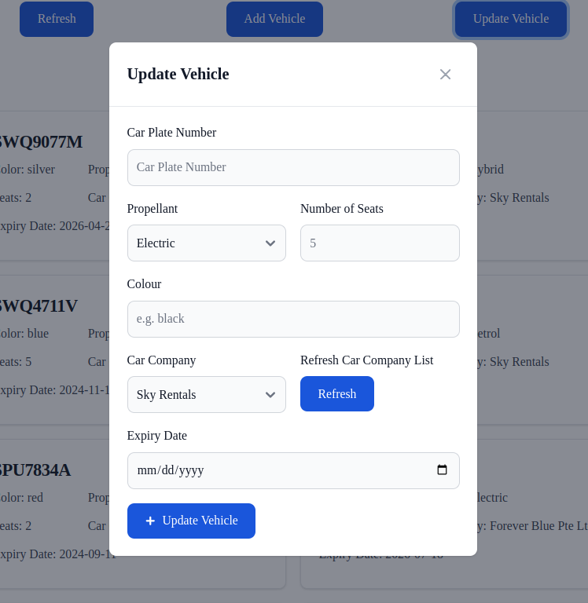
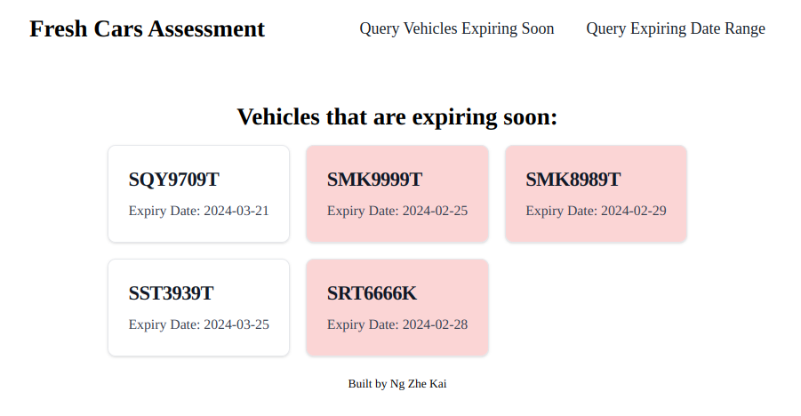
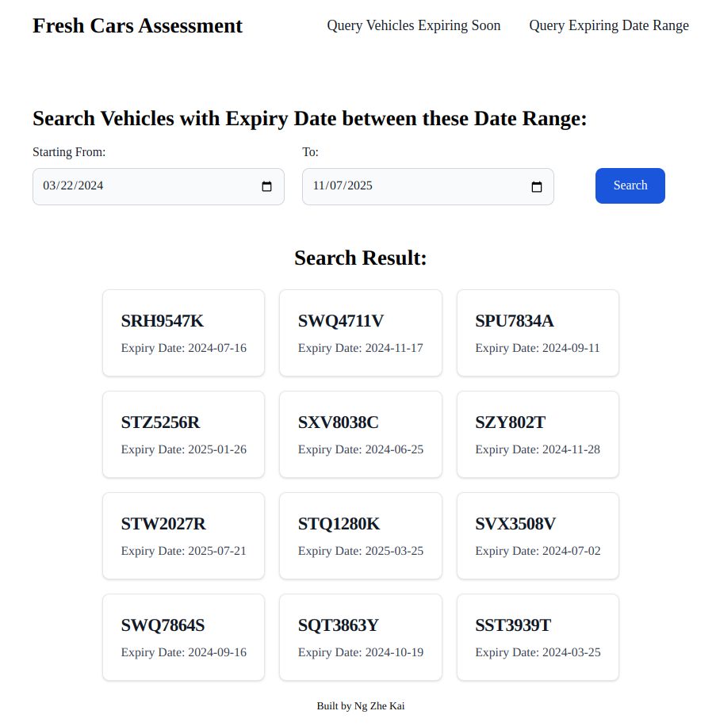

# Fresh Cars Assessment

### Database Schema



## Backend (FastAPI) - How to Run?

Before Backend server can be up and running, dependencies have to be installed.

> setting up virtual python environment is highly encouraged
> refer [here](https://www.freecodecamp.org/news/how-to-setup-virtual-environments-in-python/) for setting up virtual python environment

Install FastAPI dependencies

```bash
pip install "fastapi[all]"
```

Install `uvicorn` to work as the backend server

```bash
pip install "uvicorn[standard]"
```

Run the backend server by using the following command

```bash
uvicorn backend.main:app --reload
```



> server is ready

## Frontend (NextJS) - How to Run?

Same goes for the frontend before a server can be started. Packages have to be installed.

```bash
pnpm install
```

Run the frontend server by using the following command

```bash
pnpm run dev
```



> server is ready!

## Screenshots of the Web application

### List the Vehicles



### Add Vehicle



### Update Vehicle



### List Vehicles that are expiring soon (1 month)



> highlights in red are expiring less than 2 weeks.

### List Vehicles within Selected Date Range



---

### API Endpoints

API Endpoints can also be viewed through the FastAPI Interactive API docs

Visit [http://127.0.0.1:8000/docs](http://127.0.0.1:8000/docs)

> ensure the backend server is up and running.
